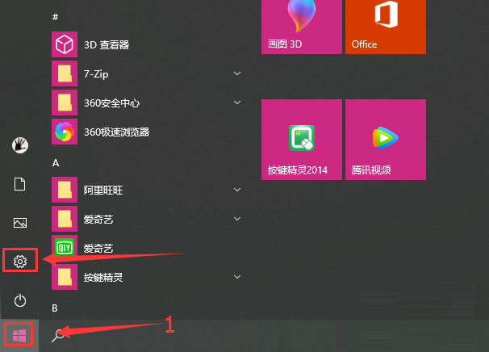
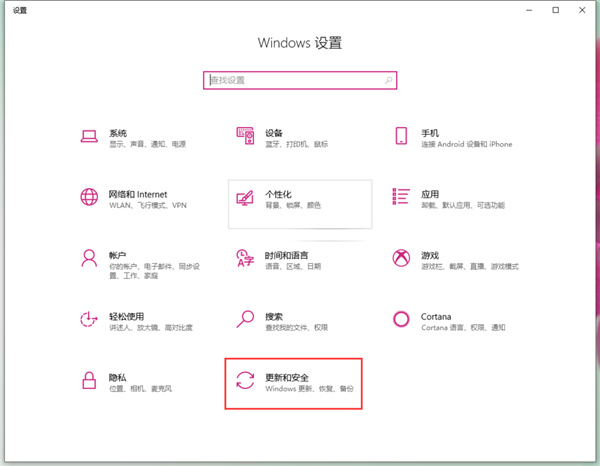
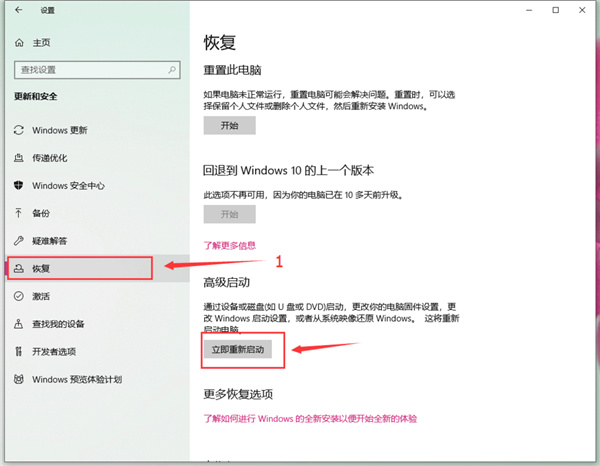
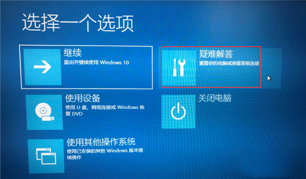
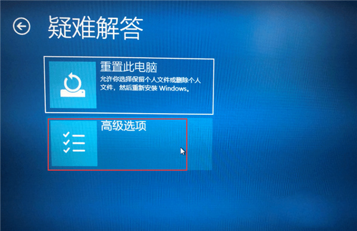
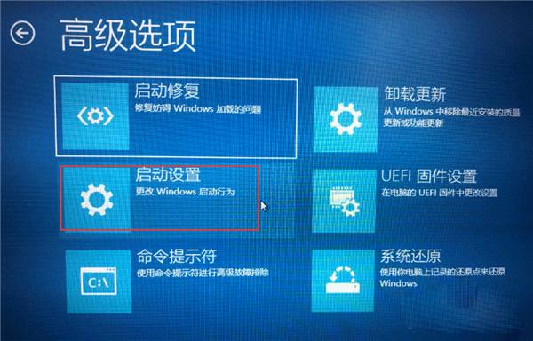
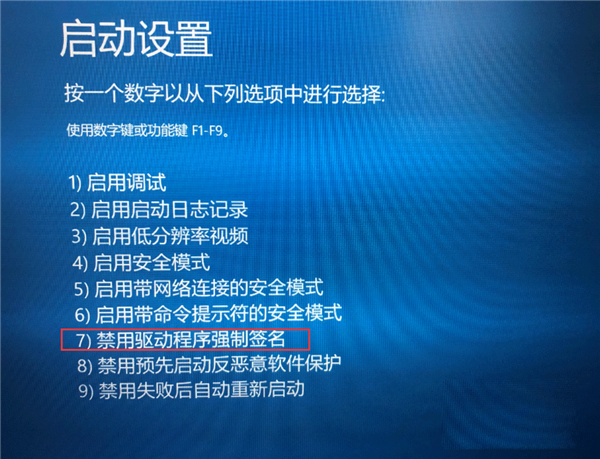

# Win10如何去除驱动数字签名 win10关闭数字签名驱动教程
-------------
> **在win10系统的使用过程之中有部分小伙伴都会遇见过驱动程序的签名问题，而为了解决这种问题来说停用签名绝对是最为简单方便的一种解决方法，那么我们又应该怎么关闭win10系统之中的驱动数字签名呐，接下来就和小编一起前去了解一下具体操作方法吧。**

## 方法一：使用系统自带设置(网上说是临时性)
> 1. 点击系统左下角的开始选项，然后我们点击开始菜单之中的设置选项;


> 2.然后我们在Windows设置界面之中的更新和安全;


> 3. 在更新和安全页面选择左侧的恢复标签，在右侧选择立即重新启动。


> 4. 在新的启动页面选择疑难解答。


> 5. 在疑难解答页面选择高级选项。


> 6. 在高级选项页面选择启动设置。


> 7. 在启动设置页面选择重启。


> 8. 系统重新启动以后在启动设置页面按“7”7或者“F7”选择禁用驱动程序强制签名即可。

----------------


## 方法二：永久禁用驱动数字签名强制 （测试通过，推荐！）
*永久禁用数字签名方法：首先，可以在BIOS设置中关闭secure boot：重启您的计算机*
> 然后：
> 1. 右键点击开始按，选择“命令提示符（管理员）”；
> 2. 输入命令执行 `bcdedit.exe /set nointegritychecks on`
> 要恢复签名，就在“命令提示符（管理员）”中输入或复制：`bcdedit.exe /set nointegritychecks off` 回车，就行了！

```
test123123123
```
